# SoundScope — **Visualización Multidimensional de Datos de Spotify**
By: Ricardo Amiel Acuña Villogas

Boceto inicial en observable:: https://observablehq.com/d/bf7ebbd7f7c99696

---

## Tabla de contenidos

1. [Introducción](#1-introducción)
2. [Dataset y preprocesamiento](#2-dataset-y-preprocesamiento)
3. [Arquitectura del sistema](#3-arquitectura-del-sistema)
4. [Tareas analíticas](#4-tareas-analíticas)
5. [Visualizaciones multidimensionales](#5-visualizaciones-multidimensionales)
   - 5.1 [RadViz](#51-radviz)
   - 5.2 [Star Coordinates](#52-star-coordinates)
   - 5.3 [Parallel Coordinates](#53-parallel-coordinates)
   - 5.4 [PCA](#54-pca--principal-component-analysis)
   - 5.5 [t-SNE](#55-t-sne)
   - 5.6 [UMAP](#56-umap)
6. [Visualizaciones de soporte](#6-visualizaciones-de-soporte)
   - 6.1 [Joyplot temporal](#61-joyplot-temporal)
   - 6.2 [Treemap de géneros](#62-treemap-de-géneros)
   - 6.3 [Correlación de features](#63-matriz-de-correlación)
   - 6.4 [Explicit rate](#64-explicit-rate-a-lo-largo-del-tiempo)
   - 6.5 [Duración y Loudness War](#65-duración-y-loudness-war)
   - 6.6 [Red de artistas (Ego Network)](#66-red-de-artistas--ego-network)
   - 6.7 [Radar de artista](#67-radar-de-artista)
7. [Sistema de interacción coordinada](#7-sistema-de-interacción-coordinada)
8. [Insights descubiertos](#8-insights-descubiertos)
9. [Stack técnico](#9-stack-técnico)
10. [Instrucciones de ejecución](#10-instrucciones-de-ejecución)

---

## 1. Introducción

SoundScope es un sistema de visualización multidimensional interactivo construido sobre el dataset de Spotify de Kaggle. El objetivo es revelar patrones latentes en 100 años de música a través de técnicas de visualización de alta dimensionalidad, permitiendo al usuario explorar más de 2 000 géneros musicales, sus relaciones sonoras, su evolución temporal y los artistas que los definen.

El sistema implementa cuatro técnicas de visualización multidimensional obligatorias (RadViz, Star Coordinates, Parallel Coordinates y proyecciones de reducción de dimensionalidad), más un conjunto de visualizaciones de soporte que permiten exploración libre de los datos.

Toda la interfaz está construida con **D3.js v7** en el frontend y **Flask** en el backend. Las vistas están **coordinadas mediante un sistema de brush global**: cualquier selección en cualquier gráfico se propaga a todas las demás vistas simultáneamente.

---

## 2. Dataset y preprocesamiento

### 2.1 Los 5 archivos CSV utilizados

| Archivo | Filas | Descripción | Uso principal |
|---|---|---|---|
| `data.csv` | 170 653 | Tracks individuales con nombre, artista, año, explicit | Calcular tasa de contenido explícito por año |
| `data_by_year.csv` | 100 | Promedio de features por año (1921–2020) | Joyplot temporal, duración, loudness |
| `data_by_genres.csv` | 2 973 | Promedio de features por género | **Fuente principal**: RadViz, Star, Parallel, PCA, t-SNE, UMAP |
| `data_w_genres.csv` | 28 680 | Artistas con sus géneros como lista parseada | Red de artistas, treemap de familias |
| `data_by_artist.csv` | 28 680 | Promedio de features por artista + conteo | Bar chart, radar de artista |

### 2.2 Pipeline de preprocesamiento

El script `preprocess.py` ejecuta los siguientes pasos antes de iniciar la aplicación:

**Paso 1 — Filtrado de géneros**
De los 2 973 géneros totales se retienen solo aquellos con popularidad > 35, resultando en **2 092 géneros** representativos. Los géneros con `[]` (sin etiqueta) son descartados.

**Paso 2 — Normalización MinMax [0, 1]**
Las 7 features de audio (`danceability`, `energy`, `valence`, `acousticness`, `speechiness`, `instrumentalness`, `liveness`) se normalizan con `MinMaxScaler`. Los campos `loudness` (rango −20 a −6 dB) y `tempo` (60–200 BPM) también se normalizan a `loudness_n` y `tempo_n`.

**Paso 3 — Clustering KMeans (k = 6)**
Se aplica `StandardScaler` + `KMeans(k=6)` sobre las 7 features. Cada género recibe una etiqueta de cluster. Los 6 clusters identificados son:

| Cluster | Nombre | Características | Géneros representativos |
|---|---|---|---|
| 0 | Dance / Upbeat | energy=0.67, dance=0.66, val=0.68 | basshall, south african house, trap venezolano |
| 1 | Acoustic / Organic | energy=0.20, dance=0.33, acoustic=0.79 | lo-fi house, shush, white noise |
| 2 | Ambient / Instrumental | energy=0.21, instrm=0.69, acoustic=0.79 | binaural, brain waves, asmr |
| 3 | Indie / Alternative | energy=0.46, dance=0.54, acoustic=0.50 | indie triste, modern indie pop, bedroom pop |
| 4 | Experimental | energy=0.67, dance=0.51, instrm=0.28 | russian dance, canadian house, experimental folk |
| 5 | Electronic / High Energy | energy=0.80, dance=0.46, acoustic=0.09 | turkish edm, circuit, guaracha |

**Paso 4 — Reducción de dimensionalidad**
- **PCA 2D**: explica 40.5% (PC1) + 20.7% (PC2) = 61.2% de la varianza. PC1 separa el eje acústico/orgánico vs. electrónico/energético.
- **t-SNE 2D**: `perplexity=20`, `max_iter=1000`. Resalta clusters locales densos.
- **UMAP 2D**: `n_neighbors=15`, `min_dist=0.1`. Preserva estructura global + local.

**Paso 5 — Red de artistas**
Se parsean los géneros de `data_w_genres` con `ast.literal_eval()`. Se construyen edges entre los 80 artistas más populares con al menos 1 género compartido (287 enlaces resultantes).

**Paso 6 — Agregaciones adicionales**
- Tasa de explicit por año desde `data.csv` → `year_trends.json`
- Treemap de 10 familias de géneros (Pop, Rock, Hip-Hop, Electronic, Latin, R&B, Country, Classical, Metal, K-Pop)

---

## 3. Arquitectura del sistema

```
soundscope/
├── app.py                    # Flask backend — 8 endpoints /api/*
├── preprocess.py             # Pipeline de datos (ejecutar una vez)
├── requirements.txt
├── templates/
│   └── index.html            # SPA de una sola página
├── static/
│   ├── css/
│   │   └── style.css         # Variables CSS tema dark/light
│   └── js/
│       ├── state.js          # Estado global + event bus + tooltip
│       ├── main.js           # Orquestador: carga, navegación, sidebar
│       └── charts/
│           ├── projection.js # PCA / t-SNE / UMAP
│           ├── parallel.js   # Parallel Coordinates
│           ├── radviz.js     # RadViz
│           ├── star.js       # Star Coordinates
│           ├── joyplot.js    # Ridge / Joy Plot
│           ├── treemap.js    # Treemap + Correlation matrix
│           ├── network.js    # Ego Network + Radar
│           └── extras.js     # Explicit rate + Duration + Artist bar
└── data/                     # JSON pre-procesados (generados por preprocess.py)
    ├── genres.json           # 2092 géneros con clusters + PCA/tSNE/UMAP + features_n
    ├── year.json             # 100 años con explicit_rate + loudness_n
    ├── artists.json          # Top 200 artistas
    ├── network.json          # {nodes: 80, edges: 287}
    ├── year_trends.json      # Explicit rate + duración por año
    ├── treemap.json          # 10 familias de géneros
    └── pca_meta.json         # Varianza explicada + loadings
```

### Flujo de datos

```
CSV files  →  preprocess.py  →  JSON files  →  Flask /api/*  →  D3.js charts
                                                        ↕
                                               State.emit('brush')
                                                        ↕
                                           Todos los charts sincronizan
```

### Sistema de estado global

```javascript
State.brush(genres[])    // Actualiza brushedGenres → emite evento
State.on('brush', fn)    // Suscribe cualquier chart al evento
State.colorBy            // 'cluster' | 'popularity' | feature
State.projMode           // 'pca' | 'tsne' | 'umap'
State.activeFeats        // Set de features activas
```

---

## 4. Tareas analíticas

El sistema responde a tres tareas analíticas principales que estructuran la navegación:

### T1 · Clustering: ¿Cómo se agrupan los géneros por features de audio?

**Hipótesis**: existen grupos naturales de géneros con perfiles sonoros similares que corresponden a macro-familias musicales.

**Visualizaciones que responden esta tarea**: Proyección (PCA/t-SNE/UMAP) + RadViz + Star Coordinates + Treemap

**Acceso**: Tab "Dashboard" → Task pill "T1 · Clustering"

---

### T2 · Evolución: ¿Cómo cambió la música en 100 años?

**Hipótesis**: la música se volvió más energética, más corta y más explícita en el siglo XX. La era más "feliz" (valence alta) fue la de los 70s; la más "triste" es la de los 2010s.

**Visualizaciones que responden esta tarea**: Joyplot temporal + Explicit rate + Duración & Loudness war

**Acceso**: Tab "Temporal" → Task pill "T2 · Evolución"

---

### T3 · Correlación: ¿Qué hace popular a un género?

**Hipótesis**: la energía y la danceability correlacionan positivamente con la popularidad; la acousticness y la instrumentalness correlacionan negativamente.

**Visualizaciones que responden esta tarea**: Parallel Coordinates + Correlation matrix + Scatter de artistas

**Acceso**: Tab "Multidimensional" → Task pill "T3 · Correlación"

---

## 5. Visualizaciones multidimensionales

### 5.1 RadViz

**Descripción**: RadViz proyecta datos de alta dimensión dentro de un círculo unitario. Cada feature ocupa una posición fija en la periferia (el ancla). Cada punto (género) es atraído hacia cada ancla con una fuerza proporcional a su valor normalizado en esa dimensión. La posición final del punto es el promedio ponderado:

$$p = \frac{\sum_{i=1}^{n} d_i \cdot a_i}{\sum_{i=1}^{n} d_i}$$

Donde $d_i$ es el valor normalizado de la dimensión $i$ y $a_i$ es la posición del ancla en el círculo.

**Datos**: `genres.json` — 2 092 géneros con features normalizadas (`feature_n`)

**Interacciones implementadas**:
- **Drag de anclas**: cada ancla (círculo de color en la periferia) puede arrastrarse libremente para cambiar su posición angular. El plot se recalcula en tiempo real.
- **Hover**: muestra tooltip con nombre del género + todas las features. El panel lateral derecho muestra barras de progreso por feature.
- **Click en punto**: brush del género seleccionado → sincroniza todas las vistas.
- **Color-by**: el dropdown del sidebar cambia el esquema de colores entre cluster, popularidad y features individuales.

---

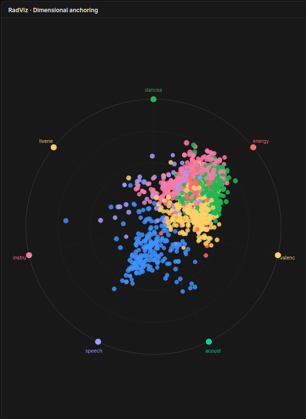

---

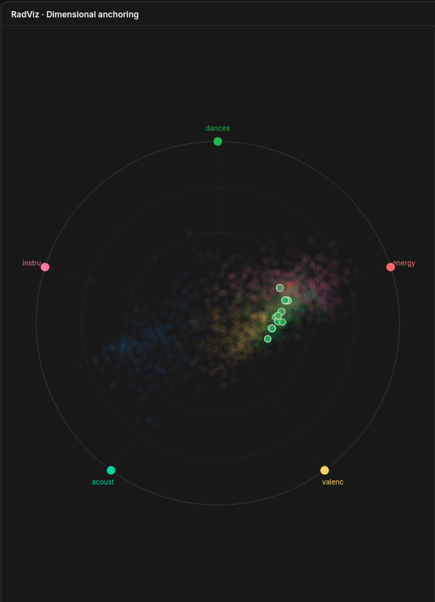

---

### 5.2 Star Coordinates

**Descripción**: Star Coordinates es similar a RadViz pero sin la normalización del denominador. La posición 2D de cada punto se calcula como la suma vectorial de las contribuciones de cada eje:

$$p = \sum_{i=1}^{n} d_i \cdot v_i$$

Donde $d_i$ es el valor normalizado y $v_i$ es el vector de dirección del eje $i$ (definido por el usuario mediante drag). Esto permite al usuario controlar la proyección cambiando los ángulos de los ejes.

**Datos**: `genres.json` — mismos 2 092 géneros

**Interacciones implementadas**:
- **Drag de extremos de ejes**: el círculo coloreado al final de cada eje puede arrastrarse para cambiar su ángulo. La proyección se actualiza en tiempo real.
- **Toggle de features**: los checkboxes del panel lateral activan/desactivan features individuales. Al desactivar una feature, su eje desaparece del gráfico y los puntos se recalculan sin esa dimensión.
- **Hover**: tooltip + actualización del panel de detalle.
- **Brush y linking**: click en punto → propaga selección a todas las vistas.

---

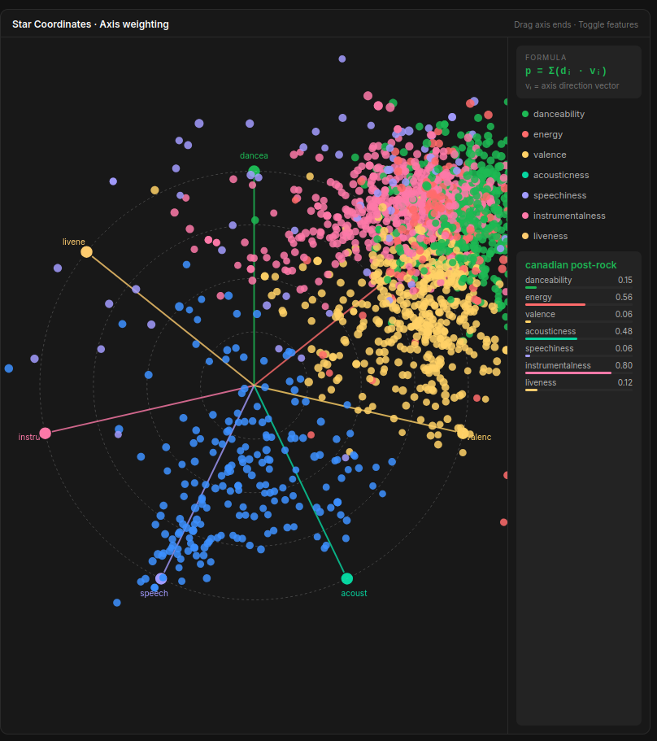

---

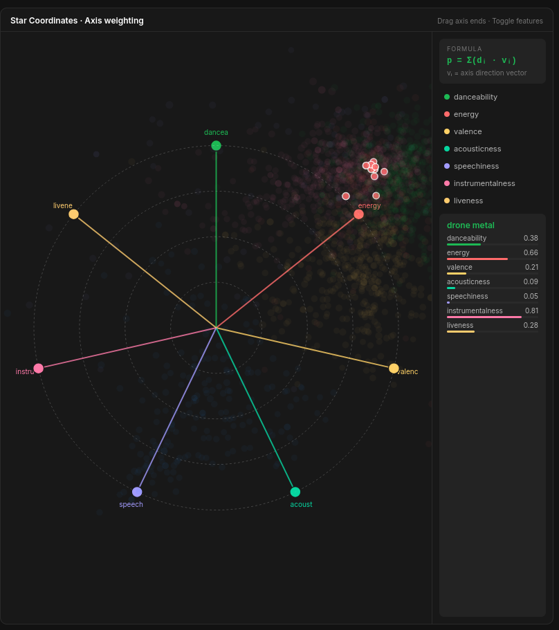

---

### 5.3 Parallel Coordinates

**Descripción**: Parallel Coordinates representa cada género como una línea poligonal que atraviesa n ejes verticales paralelos, uno por feature. Permite identificar correlaciones positivas (líneas paralelas), correlaciones negativas (líneas que se cruzan) y la distribución de valores en cada dimensión. Los valores se normalizan con:

$$y_i = \frac{x_i - \min(x)}{\max(x) - \min(x)}$$

**Datos**: `genres.json` — 2 092 géneros, usando las columnas `feature_n` normalizadas

**Interacciones implementadas**:
- **Brush por eje**: cada eje vertical tiene un brush independiente. Al seleccionar un rango en un eje, solo las líneas que atraviesan ese rango quedan visibles; el resto se atenúa a 3% de opacidad.
- **Reordenar ejes**: arrastrar la etiqueta de cualquier eje (texto superior) para cambiar su posición. Las líneas se redibujan instantáneamente.
- **Multi-brush**: se pueden aplicar brushes simultáneamente en múltiples ejes para filtrar con condiciones compuestas (e.g., energy alto Y acousticness bajo).
- **Color-by**: las líneas se colorean según el dropdown del sidebar.
- **Linking**: el subconjunto filtrado por brush se sincroniza con RadViz, Star y Proyección.

---

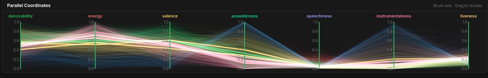

---

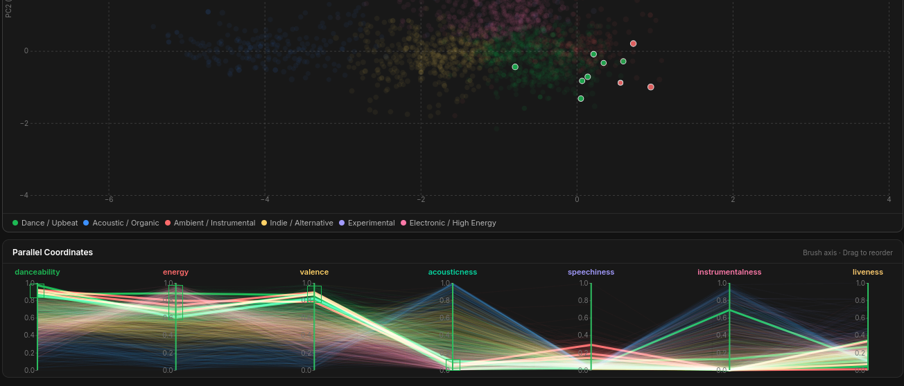
---

### 5.4 PCA — Principal Component Analysis

**Descripción**: PCA es una proyección lineal que maximiza la varianza explicada en cada componente. Se aplica `StandardScaler` antes de PCA para evitar que features con mayor escala dominen la proyección.

$$Z = XW$$

Los dos primeros componentes explican:
- **PC1: 40.5%** de la varianza → eje acústico/orgánico (−) vs. electrónico/energético (+). Las features con mayor loading positivo en PC1 son `energy` (+0.454) y `danceability` (+0.406); las de mayor loading negativo son `acousticness` (−0.440) e `instrumentalness` (−0.403).
- **PC2: 20.7%** de la varianza → eje danzable/festivo (−) vs. en vivo/ruidoso (+). `liveness` (+0.516) domina PC2.

**Datos**: `genres.json` — columnas `pca_x`, `pca_y`

**Interacciones implementadas**:
- **Zoom y pan**: rueda del ratón para zoom, arrastrar para navegar.
- **Brush de selección rectangular**: traza un rectángulo → brush global.
- **Hover**: tooltip con todas las features del género.
- **Color-by**: soporta cluster, popularidad y cualquier feature individual.
- **Switching PCA/t-SNE/UMAP**: las pills "PCA", "t-SNE", "UMAP" del sidebar redibujan el mismo scatterplot con coordenadas distintas, animando la transición.

---

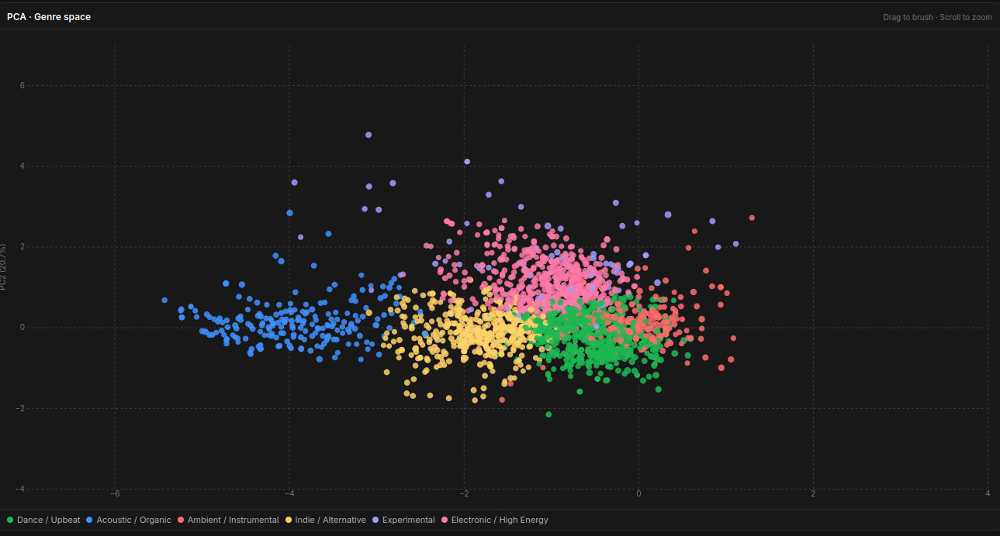

---

[PCA2](images/PCA2.png)

---

### 5.5 t-SNE

**Descripción**: t-Distributed Stochastic Neighbor Embedding es una técnica no lineal que preserva las distancias locales. Parámetros utilizados: `perplexity=20`, `max_iter=1000`. t-SNE produce clusters más compactos y visualmente separados que PCA, a costa de no preservar distancias globales.

**Datos**: `genres.json` — columnas `tsne_x`, `tsne_y`

---

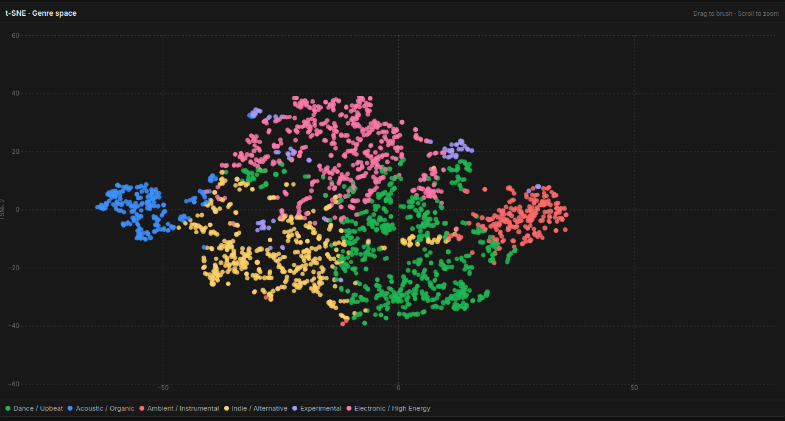

---

### 5.6 UMAP

**Descripción**: Uniform Manifold Approximation and Projection preserva tanto la estructura local como la global del espacio de alta dimensión. Parámetros: `n_neighbors=15`, `min_dist=0.1`. UMAP es el método más informativo de los tres, combinando la separación de clusters de t-SNE con la coherencia global de PCA.

**Datos**: `genres.json` — columnas `umap_x`, `umap_y`

---

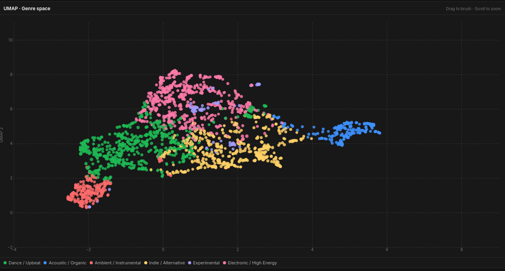

---

## 6. Visualizaciones de soporte

### 6.1 Joyplot temporal

**Descripción**: Ridge plot (joyplot) con múltiples series temporales superpuestas. Cada serie representa la evolución de una feature de audio a lo largo de los 100 años del dataset (1921–2020). Cada curva tiene su propio dominio en el eje Y, desplazada verticalmente para evitar solapamiento. Las series incluyen: `danceability`, `energy`, `valence`, `acousticness`, `speechiness`, `explicit_rate` y `loudness_n`.

**Datos**: `year.json` (100 filas) + `year_trends.json` para `explicit_rate`

**Interacciones**: línea de hover vertical que muestra el valor exacto de cada serie en el año inspeccionado.

---

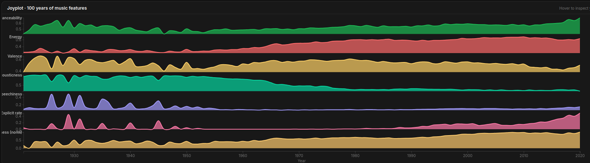

---

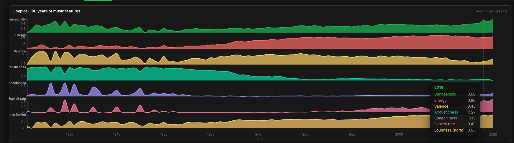

---

### 6.2 Treemap de géneros

**Descripción**: Treemap jerárquico que muestra la distribución de artistas por familia de género. El área de cada celda es proporcional al número de artistas (conteo de tags). El color distingue las 10 familias (Pop, Rock, Hip-Hop, Electronic, Latin, R&B, Country, Classical, Metal, K-Pop).

**Datos**: `treemap.json` (10 familias, conteos derivados de `data_w_genres.csv`)

**Interacciones**: click en celda → brush global que filtra todos los géneros de esa familia en las demás vistas.

---


---

### 6.3 Matriz de correlación

**Descripción**: Heatmap 7×7 que muestra el coeficiente de correlación de Pearson entre todos los pares de features de audio. La escala de colores diverge en rojo (correlación negativa) → amarillo (sin correlación) → verde (correlación positiva).

**Datos**: calculada en el cliente desde `genres.json`

**Correlaciones más destacadas encontradas**:
- `energy` ↔ `acousticness`: r = −0.82 (la más fuerte del dataset)
- `energy` ↔ `instrumentalness`: r = −0.45
- `danceability` ↔ `valence`: r = +0.38
- `energy` ↔ `popularity`: r = +0.34
- `acousticness` ↔ `popularity`: r = −0.46

---

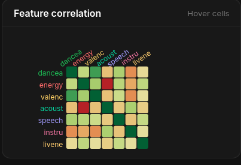

---

### 6.4 Explicit rate a lo largo del tiempo

**Descripción**: Área + línea mostrando el porcentaje de tracks con contenido explícito por año entre 2000 y 2020, calculado directamente desde `data.csv` (170 653 tracks individuales).

**Hallazgo clave**: el contenido explícito creció de ~10% en 2000 al ~49.5% en 2020 — un crecimiento 5× en 20 años, coincidiendo con el auge del trap y el rap mainstream.

---


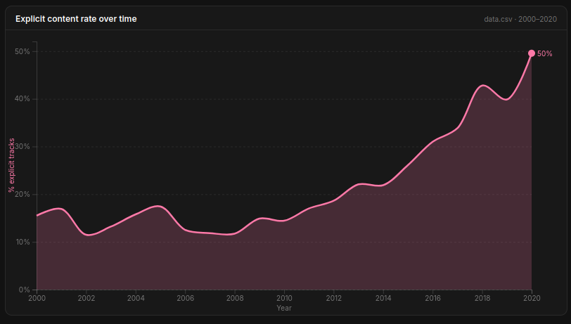

> *El punto de 2020 debe tener su etiqueta visible (~49.5%). Aceleración notable a partir de 2015–2016.*

---

### 6.5 Duración y Loudness War

**Descripción**: Gráfico dual-axis que superpone dos tendencias históricas (1960–2020): la duración promedio de las canciones (eje izquierdo, azul) y la intensidad sonora promedio en dB (eje derecho, amarillo).

**Hallazgos**:
- **Duración**: pico en 1976 (4:28 min) → mínimo histórico en 2020 (3:13 min). El streaming incentiva canciones más cortas.
- **Loudness war**: de −17 dB en 1921 a −6.6 dB en 2020. La masterización comprimida hace que la música moderna sea ~10 dB más fuerte que la de los años 20.

---


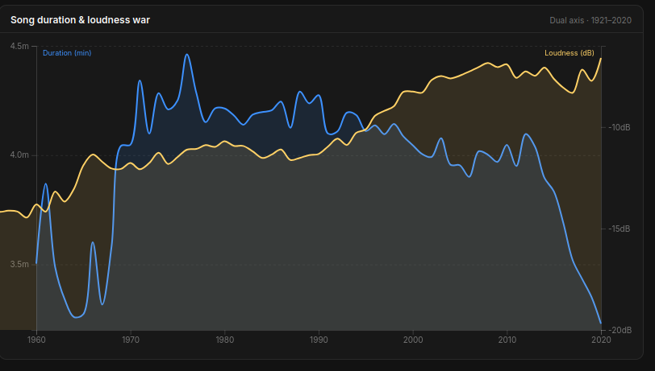

---

### 6.6 Red de artistas — Ego Network

**Descripción**: Grafo force-directed donde cada nodo es un artista y cada enlace conecta dos artistas que comparten al menos un género musical. El grosor del enlace es proporcional al número de géneros compartidos. El tamaño de los nodos es proporcional a su popularidad. Los colores distinguen el género primario del artista.

**Datos**: `network.json` — 80 nodos (artistas top por popularidad con géneros asignados), 287 enlaces

**Interacciones implementadas**:
- **Drag de nodos**: la simulación de fuerzas permite reposicionar nodos manualmente.
- **Zoom y pan**: navegación libre del grafo.
- **Hover sobre nodo**: resalta el nodo y sus vecinos directos; atenúa el resto. Las etiquetas de los nodos conectados se hacen visibles.
- **Click en nodo**: dibuja el radar de features del artista seleccionado en el panel adyacente. Actualiza el título del panel.
- **Búsqueda de artista**: el campo de búsqueda del sidebar filtra por nombre y navega a la vista de artistas.

---

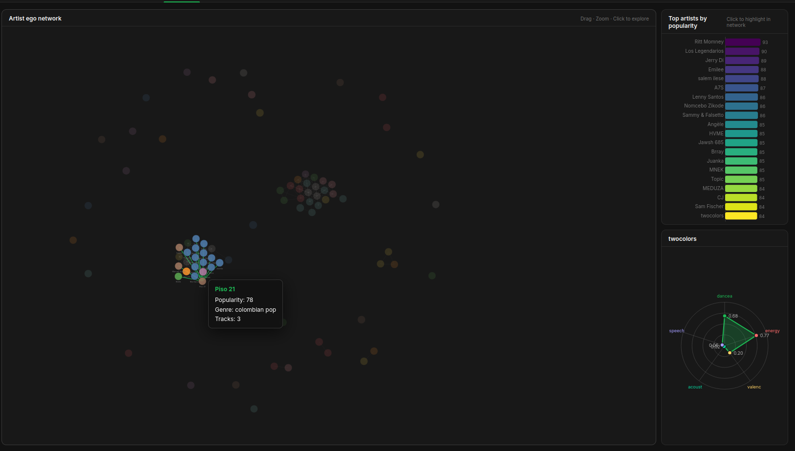

---

### 6.7 Radar de artista

**Descripción**: Polígono radar (spider chart) que muestra el perfil de features de audio de un artista en 5 dimensiones: `danceability`, `energy`, `valence`, `acousticness`, `speechiness`. Los valores utilizados son los valores normalizados del artista en `artists.json`.

**Activación**: click en cualquier nodo de la red, o click en cualquier barra del bar chart de artistas, o búsqueda desde el sidebar.

Seleccionamos al artista **Piso 21**.

---

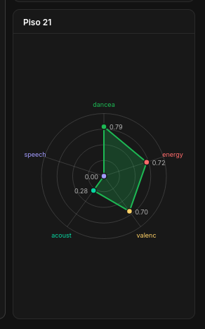

Resalta las características más pegadas de la época (energy and danceability).

---

## 7. Sistema de interacción coordinada

Todas las vistas del sistema están coordinadas a través de un **bus de eventos global** implementado en `state.js`.

### Arquitectura del event bus

```javascript
// Emitir brush desde cualquier chart
State.brush(['genre1', 'genre2', 'genre3'])

// Suscribirse al brush desde cualquier chart
State.on('brush', (genres) => {
    // Atenuar puntos no seleccionados
    svg.selectAll('.proj-point')
       .classed('dimmed', d => !State.brushedGenres.has(d.genres))
})
```

### Flujo de una interacción típica

```
Usuario dibuja brush en PCA
        ↓
Projection.js emite State.brush([géneros seleccionados])
        ↓
State actualiza brushedGenres + muestra contador en sidebar
        ↓
Event bus notifica a:
  ├── Parallel.js     → atenúa líneas no seleccionadas
  ├── RadViz.js       → atenúa puntos no seleccionados
  ├── Star.js         → atenúa puntos no seleccionados
  └── (Treemap resalta familia si coincide)
```

### Tipos de interacción implementados

| Evento | Origen | Efecto en otras vistas |
|---|---|---|
| Brush rectangular | PCA, scatter | Filtra géneros en todas las vistas |
| Brush por eje | Parallel Coordinates | Propaga subconjunto filtrado |
| Click en punto | RadViz, Star, PCA | Selecciona género único |
| Click en celda | Treemap | Filtra por familia de géneros |
| Hover en nodo | Ego network | Resalta artista + vecinos |
| Click en bar | Artist bar | Dibuja radar + foca en red |
| Sidebar family | Lista de familias | Filtra todos los charts por familia |
| Clear brush | Botón sidebar | Restablece todas las vistas |

---

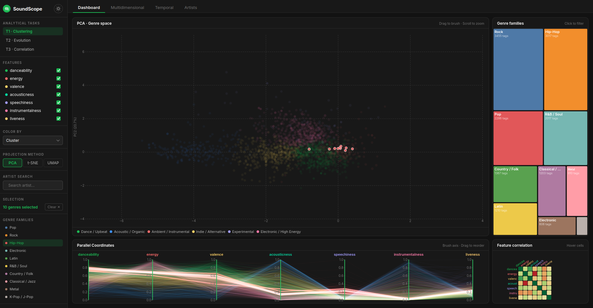

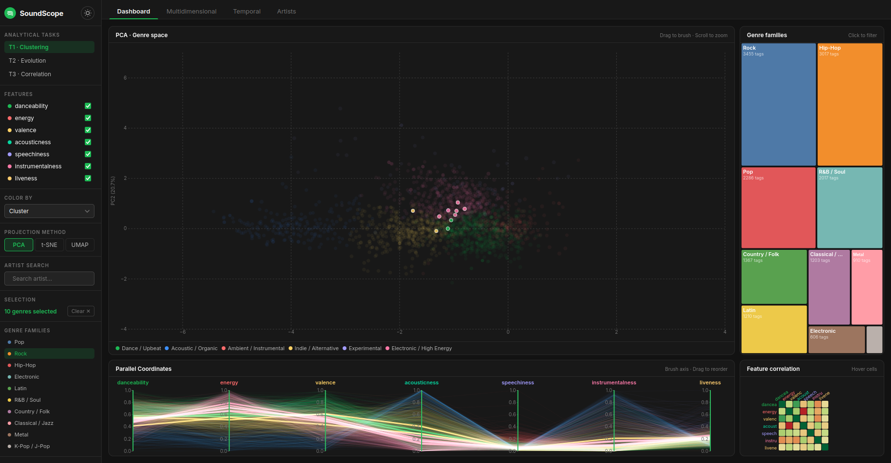

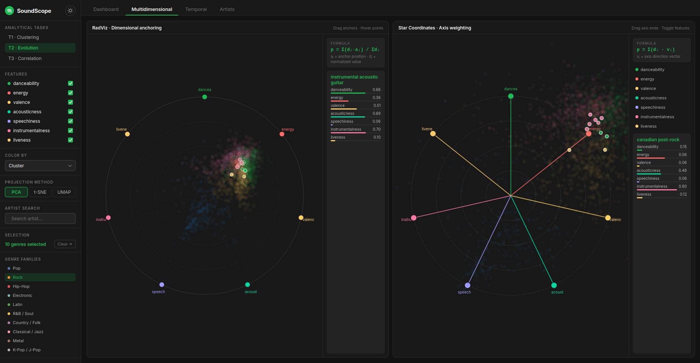

---

## 8. Insights descubiertos

Los siguientes hallazgos emergen de la exploración interactiva del dataset:

### 8.1 La música se está poniendo más triste

La `valence` (medida de positividad emocional) alcanzó su pico en los años 70 (≈0.59) y ha caído consistentemente hasta mínimos históricos en los 2010s (≈0.46). La "era más triste" de la música popular coincide con el auge del emo rap, el trap y el lo-fi.

### 8.2 El eje acústico/electrónico domina la varianza

El PC1 del PCA explica el 40.5% de la varianza total y separa perfectamente géneros orgánicos/acústicos (classical piano, acoustic blues, folk) de géneros electrónicos/energéticos (techno, dnb, circuit). Esta es la dicotomía estructural más profunda de la música.

### 8.3 La energía vende

La correlación entre `energy` y `popularity` es r = +0.34, mientras que `acousticness` vs `popularity` es r = −0.46. Los géneros más populares tienden a ser energéticos, no acústicos.

### 8.4 Géneros geográficos forman clusters locales en t-SNE/UMAP

Géneros como "trap venezolano", "argentine hip hop", "pagode baiano", "korean mask singer" y "turkish edm" aparecen agrupados con sus equivalentes geográficos cercanos en t-SNE y UMAP, sugiriendo que la geografía influye en el perfil sonoro de los géneros (sudamérica).

### 8.5 La Loudness War es estadísticamente verificable

La intensidad sonora promedio aumentó de −17 dB (1921) a −6.6 dB (2020), un incremento de más de 10 dB en un siglo. Esto refleja la práctica de masterización dinámica comprimida para que las canciones "suenen más fuerte" en radio y streaming.

### 8.6 El contenido explícito creció 5× en 20 años

De 10% de tracks explícitas en el año 2000 a ~50% en 2020. La aceleración es más pronunciada a partir de 2015, cuando el trap y el rap urbano se convirtieron en los géneros dominantes globalmente.

### 8.7 Las canciones se están acortando por el streaming

La duración promedio alcanzó su pico en 1976 (4:28 min) y ha caído hasta 3:13 min en 2020. Los algoritmos de las plataformas de streaming favorecen canciones que retienen oyentes desde los primeros segundos.

---

## 9. Stack técnico

| Componente | Tecnología | Versión |
|---|---|---|
| Backend | Python / Flask | ≥ 2.3 |
| Visualizaciones | D3.js | v7 |
| Estilos | CSS Variables (dark/light) | — |
| JavaScript | Vanilla ES6+ | — |
| Preprocesamiento | pandas, scikit-learn, umap-learn | — |
| Reducción dimensionalidad | PCA, t-SNE, UMAP | sklearn + umap-learn |
| Clustering | KMeans | sklearn |
| Normalización | MinMaxScaler, StandardScaler | sklearn |

---

## 10. Instrucciones de ejecución

### Requisitos

```bash
pip install flask pandas numpy scikit-learn umap-learn
```

### Ejecución

```bash
# 1. Ejecutar el preprocesamiento (genera los JSON en /data)
python preprocess.py

# 2. Iniciar la aplicación Flask
python app.py

# 3. Abrir en el navegador
# http://localhost:5050
```

### Estructura de navegación

```
Dashboard        → Proyección + Treemap + Parallel Coords + Correlación
Multidimensional → RadViz + Star Coordinates
Temporal         → Joyplot + Explicit rate + Duración/Loudness
Artists          → Ego network + Bar chart + Radar de artista
```

### Controles del sidebar

- **Toggle dark/light**: botón de sol/luna en la cabecera del sidebar
- **Task pills**: navegan directamente a la vista correspondiente a cada tarea analítica
- **Features**: activan/desactivan dimensiones en RadViz y Star Coordinates
- **Color by**: cambia el esquema de colores en todas las proyecciones
- **Projection**: cambia entre PCA, t-SNE y UMAP
- **Artist search**: autocomplete para buscar artistas y dibujar su perfil
- **Genre families**: filtra todos los charts por macro-familia de género
- **Clear selection**: elimina el brush activo y restaura todas las vistas

---